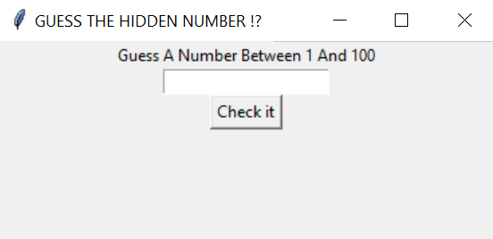

# guess_nbr-simple-game-
This code sets up a simple Tkinter window for a number guessing game, where the user can input a guess, click a "Check" button, and receive feedback on whether their guess is correct or not.

